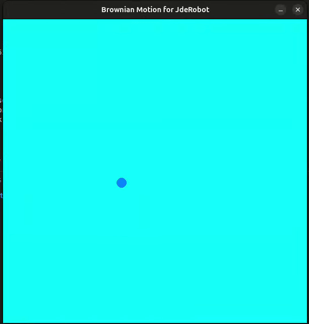

<div align="center">

  <h3 align="center">JdeRobot - Python Challenge</h3>

  <p align="center">
  JdeRobot GSOC-2025 Python Challenge
  </br>

  </p>
</div>

<!-- ABOUT THE PROJECT -->

## Demo

<div align="center">
<a href="" target="_blank">Youtube - Demo Video</a>
</div>
</br>
</br>



<div align="center">gif</div>

<!-- GETTING STARTED -->

## Getting Started

#### Installation Process

1. Clone the repo
    ```sh
    https://github.com/codezerro/JdeRobot-gsoc-2025-python-challenge.git
    ```
2. Create python environment
    ```python
    python3 -m venv env
    ```
3. Active the environment
    ```python
    source env/bin/activate
    ```
4. Install package
    ```python
    pip install pygame
    ```
5. Run the app
    ```python
    python3 app.py
    ```

<!-- CONTACT -->

## Contact

Md.Shariar Kabir - [@linkedin](https://www.linkedin.com/in/md-shariar-kabir-238171160/)
